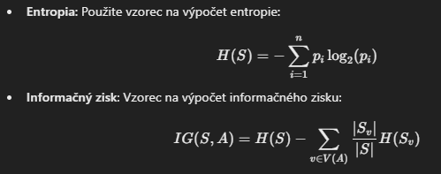

# Fáza 3.1 - Jednoduchý Klasifikátor na Základe Závislostí v Dátach

V tejto časti vytvoríme jednoduchý klasifikátor na základe algoritmu ID3, vyhodnotíme jeho výkonnosť pomocou metrík a posúdime, či trpí problémom overfittingu.

---

## (A-3b) Implementácia ID3 Klasifikátora s Hĺbkou min. 2

Algoritmus ID3 (Iterative Dichotomiser 3) vytvára rozhodovacie stromy na základe entropie a informačného zisku. Nasledujú kroky na implementáciu ID3 klasifikátora:
1. **Rozdeľte dáta na tréningovú a testovaciu množinu.**
2. **Implementujte výpočet entropie a informačného zisku.**
3. **Vytvorte funkciu na budovanie stromu s hĺbkou minimálne 2 (koreň + 1 úroveň pod koreňom).**
4. **Použite rozhodovací strom na predikciu tried pre testovacie dáta.**

### Krok 1: Rozdelenie dát
Rozdeľte dáta na tréningovú a testovaciu množinu s pomerom napr. 80:20.

```python
from sklearn.model_selection import train_test_split

X_train, X_test, y_train, y_test = train_test_split(X_selected, y, test_size=0.2, random_state=42)
```

### Krok 2: Výpočet entropie a informačného zisku


Príklad funkcie na výpočet entropie:

```py
import numpy as np

def entropy(y):
    counts = np.bincount(y)
    probabilities = counts / len(y)
    return -np.sum([p * np.log2(p) for p in probabilities if p > 0])
```

Príklad výpočtu informačného zisku:

```py
class ID3Tree:
    def __init__(self, max_depth=2):
        self.max_depth = max_depth
        self.tree = {}

    def fit(self, X, y, depth=0):
        # Skončíme, ak dosiahneme max. hĺbku alebo ak máme čistý uzol
        if depth >= self.max_depth or len(np.unique(y)) == 1:
            return np.argmax(np.bincount(y))
        
        # Vyberte atribút s najvyšším IG
        best_feature = np.argmax([information_gain(X, y, i) for i in range(X.shape[1])])
        tree = {best_feature: {}}
        
        # Rozdeľte dáta a vytvorte vetvy
        values = np.unique(X[:, best_feature])
        for value in values:
            subset_X = X[X[:, best_feature] == value]
            subset_y = y[X[:, best_feature] == value]
            tree[best_feature][value] = self.fit(subset_X, subset_y, depth + 1)
        
        self.tree = tree
        return tree

    def predict_one(self, x):
        node = self.tree
        while isinstance(node, dict):
            feature = list(node.keys())[0]
            value = x[feature]
            node = node[feature].get(value, np.argmax(np.bincount(y_train)))
        return node

    def predict(self, X):
        return np.array([self.predict_one(x) for x in X])
```

## (B-1b) Vyhodnotenie ID3 Klasifikátora pomocou Metrík
Po natrénovaní modelu vyhodnoťte jeho výkonnosť pomocou metrík accuracy, precision a recall.

### Kód na vyhodnotenie
Použite metriky zo sklearn.metrics na výpočet:

```py
from sklearn.metrics import accuracy_score, precision_score, recall_score

# Predikcie na testovacích dátach
y_pred = id3_tree.predict(X_test)

# Výpočet metrík
accuracy = accuracy_score(y_test, y_pred)
precision = precision_score(y_test, y_pred)
recall = recall_score(y_test, y_pred)

print(f"Accuracy: {accuracy:.2f}")
print(f"Precision: {precision:.2f}")
print(f"Recall: {recall:.2f}")
```
----

## (C-1b) Overenie Overfittingu
Overfitting nastáva, ak model dosahuje veľmi vysokú presnosť na tréningových dátach, ale slabú výkonnosť na testovacích dátach. Môžete to posúdiť porovnaním presnosti na tréningovej a testovacej množine.

### Kód na detekciu overfittingu

```py
# Predikcie na tréningovej množine
y_train_pred = id3_tree.predict(X_train)

# Výpočet presnosti na tréningových a testovacích dátach
train_accuracy = accuracy_score(y_train, y_train_pred)
test_accuracy = accuracy_score(y_test, y_pred)

print(f"Training Accuracy: {train_accuracy:.2f}")
print(f"Test Accuracy: {test_accuracy:.2f}")

if train_accuracy - test_accuracy > 0.1:
    print("Model pravdepodobne trpí overfittingom.")
else:
    print("Model neprejavuje výrazné znaky overfittingu.")
```

## Zhrnutie
1. Implementovali sme ID3 klasifikátor s minimálnou hĺbkou 2.
2. Vyhodnotili sme výkonnosť klasifikátora pomocou metrík accuracy, precision a recall.
3. Skontrolovali sme overfitting porovnaním presnosti na tréningovej a testovacej množine.

Použitím týchto krokov môžete efektívne implementovať a analyzovať jednoduchý ID3 klasifikátor pre váš dataset.

# Fáza 3.2 - Trénovanie a Vyhodnotenie Klasifikátorov Strojového Učenia

V tejto časti natrénujeme dva klasifikátory (jeden stromový a jeden nestromový), porovnáme ich s výsledkami ID3, vizualizujeme pravidlá a vyhodnotíme ich výkonnosť pomocou metrík.

---

## (A-1b) Trénovanie Stromového Algoritmu v Scikit-learn

Použijeme **DecisionTreeClassifier** zo scikit-learn, čo je implementácia klasifikačného rozhodovacieho stromu.

### Kód na trénovanie stromového klasifikátora
```python
from sklearn.tree import DecisionTreeClassifier

# Trénovanie stromového klasifikátora
tree_clf = DecisionTreeClassifier(max_depth=3, random_state=42)
tree_clf.fit(X_train, y_train)
```

## (B-1b) Porovnanie s Nestromovým Algoritmom
Ako nestromový klasifikátor zvolíme napríklad LogisticRegression, ktorý je populárnym algoritmom pre binárnu klasifikáciu.

### Kód na trénovanie nestromového klasifikátora

```py
from sklearn.linear_model import LogisticRegression

# Trénovanie logistickej regresie
log_reg = LogisticRegression(random_state=42, max_iter=1000)
log_reg.fit(X_train, y_train)
```

## (C-1b) Porovnanie Výsledkov s ID3
Vyhodnotíme výkonnosť ID3, DecisionTreeClassifier a LogisticRegression na rovnakom testovacom sete a porovnáme výsledky.

### Kód na porovnanie

```py 
from sklearn.metrics import accuracy_score, precision_score, recall_score

# Predikcie
y_pred_tree = tree_clf.predict(X_test)
y_pred_log_reg = log_reg.predict(X_test)

# Výsledky pre ID3, DecisionTree a Logistic Regression
models = {
    "ID3": y_pred_id3,
    "Decision Tree": y_pred_tree,
    "Logistic Regression": y_pred_log_reg
}

for model_name, y_pred in models.items():
    accuracy = accuracy_score(y_test, y_pred)
    precision = precision_score(y_test, y_pred)
    recall = recall_score(y_test, y_pred)
    print(f"{model_name}:")
    print(f"  Accuracy: {accuracy:.2f}")
    print(f"  Precision: {precision:.2f}")
    print(f"  Recall: {recall:.2f}\n")
```


## (D-1b) Vizualizácia Pravidiel pre Vybraný Algoritmus
Vyberieme DecisionTreeClassifier na vizualizáciu pravidiel, pretože rozhodovacie stromy sú ľahko interpretovateľné.

### Vizualizácia rozhodovacieho stromu
Použijeme plot_tree zo scikit-learn na vizualizáciu pravidiel stromu:

```py
from sklearn.tree import plot_tree
import matplotlib.pyplot as plt

# Vizualizácia rozhodovacieho stromu
plt.figure(figsize=(12, 8))
plot_tree(tree_clf, feature_names=X_train.columns, class_names=['mwra=0', 'mwra=1'], filled=True)
plt.show()
```

##(E-1b) Vyhodnotenie Modelov pomocou Metrík
Vyhodnotíme presnosť, presnosť (precision) a odvolanie (recall) pre všetky tri modely.

### Kód na výpočet metrík
Použitie už spomenutého kódu na výpočet metrík:

```py
for model_name, y_pred in models.items():
    accuracy = accuracy_score(y_test, y_pred)
    precision = precision_score(y_test, y_pred)
    recall = recall_score(y_test, y_pred)
    print(f"{model_name}:")
    print(f"  Accuracy: {accuracy:.2f}")
    print(f"  Precision: {precision:.2f}")
    print(f"  Recall: {recall:.2f}\n")
```

## Zhrnutie
1. Trénovali sme DecisionTreeClassifier a LogisticRegression ako zástupcov stromových a nestromových klasifikátorov.
2. Porovnali sme výkonnosť ID3, DecisionTreeClassifier a LogisticRegression pomocou metrík accuracy, precision a recall.
3. Vizualizovali sme pravidlá rozhodovacieho stromu pomocou plot_tree.
4. Vyhodnotili sme výkonnosť modelov, aby sme identifikovali, ktorý z nich je najvhodnejší pre predikciu cieľovej premennej mwra.


# Fáza 3.3 - Optimalizácia alias Hyperparameter Tuning

V tejto časti sa zameriame na optimalizáciu modelu pomocou ladenia hyperparametrov, kombinácie modelov (ensemble learning), krížovej validácie a posúdenia, či model netrpí overfittingom.

---

## (A-1b) Tuning Hyperparametrov

Hyperparameter tuning umožňuje nájsť optimálne nastavenia modelu pre dosiahnutie najlepšej výkonnosti. Na tento účel použijeme mriežkový vyhľadávač (`GridSearchCV`).

### Príklad: Tuning pre DecisionTreeClassifier
```python
from sklearn.model_selection import GridSearchCV

# Definícia parametrov pre mriežkový vyhľadávač
param_grid = {
    'max_depth': [3, 5, 10],
    'min_samples_split': [2, 5, 10],
    'min_samples_leaf': [1, 2, 4]
}

# Použitie GridSearchCV
grid_search = GridSearchCV(DecisionTreeClassifier(random_state=42), param_grid, cv=5, scoring='accuracy')
grid_search.fit(X_train, y_train)

# Zobrazenie najlepších parametrov
print(f"Najlepšie parametre: {grid_search.best_params_}")
print(f"Najlepšia presnosť: {grid_search.best_score_:.2f}")
```

## (B-1b) Kombinácia Modelov (Ensemble Learning)
Použitím ensemble metód, ako sú Bagging, Boosting alebo Random Forest, môžeme kombinovať viaceré modely pre lepšiu výkonnosť.

### Príklad: Použitie Random Forest
Random Forest je príklad ensemble metódy založenej na baggingu.

```py
from sklearn.ensemble import RandomForestClassifier

# Trénovanie Random Forest modelu
rf_clf = RandomForestClassifier(n_estimators=100, max_depth=5, random_state=42)
rf_clf.fit(X_train, y_train)

# Predikcia a vyhodnotenie
y_pred_rf = rf_clf.predict(X_test)
```

### Príklad: Použitie Gradient Boosting
Gradient Boosting je boostingová technika na optimalizáciu výkonnosti.

```py
from sklearn.ensemble import GradientBoostingClassifier

# Trénovanie Gradient Boosting modelu
gb_clf = GradientBoostingClassifier(n_estimators=100, learning_rate=0.1, max_depth=3, random_state=42)
gb_clf.fit(X_train, y_train)

# Predikcia a vyhodnotenie
y_pred_gb = gb_clf.predict(X_test)
```

## (C-1b) Krížová Validácia
Krížová validácia pomáha vyhodnotiť model na rôznych podmnožinách dát a poskytuje lepší odhad výkonnosti modelu. Použijeme cross_val_score zo scikit-learn.

### Príklad: Krížová Validácia s Optimalizovaným Modelom


```py
from sklearn.model_selection import cross_val_score

# Použitie krížovej validácie
cv_scores = cross_val_score(grid_search.best_estimator_, X_train, y_train, cv=5, scoring='accuracy')

# Výsledky krížovej validácie
print(f"Priemerná presnosť: {cv_scores.mean():.2f}")
print(f"Rozptyl presnosti: {cv_scores.std():.2f}")
```


## (D-2b) Posúdenie Overfittingu
Aby sme dokázali, že model netrpí overfittingom, porovnáme jeho výkonnosť na tréningových a testovacích dátach. Overfitting nastáva, ak model dosahuje vysokú presnosť na tréningových dátach, ale nízku presnosť na testovacích dátach.

### Príklad: Kontrola Overfittingu
```py
# Predikcie na tréningových a testovacích dátach
y_train_pred = grid_search.best_estimator_.predict(X_train)
y_test_pred = grid_search.best_estimator_.predict(X_test)

# Výpočet presnosti
train_accuracy = accuracy_score(y_train, y_train_pred)
test_accuracy = accuracy_score(y_test, y_test_pred)

print(f"Presnosť na tréningovej množine: {train_accuracy:.2f}")
print(f"Presnosť na testovacej množine: {test_accuracy:.2f}")

if abs(train_accuracy - test_accuracy) < 0.1:
    print("Model neprejavuje výrazné znaky overfittingu.")
else:
    print("Model pravdepodobne trpí overfittingom.")
```

## Zhrnutie
1. Hyperparameter Tuning: Optimalizovali sme parametre modelu pomocou GridSearchCV.
2. Ensemble Learning: Skúšali sme kombináciu modelov pomocou Random Forest a Gradient Boosting.
3. Krížová Validácia: Vyhodnotili sme model pomocou cross_val_score, aby sme získali robustný odhad výkonnosti.
4. Overfitting: Posúdili sme, či model netrpí overfittingom porovnaním jeho presnosti na tréningových a testovacích dátach.

Tento postup umožňuje optimalizovať model, zvýšiť jeho výkonnosť a overiť jeho schopnosť generalizácie na nové dáta.


# Fáza 3.4 - Vyhodnotenie Vplyvu Zvolenej Stratégie Riešenia na Klasifikáciu

V tejto časti vyhodnotíme efektivitu použitých stratégií na predspracovanie a modelovanie dát s dôrazom na výkonnosť modelov a ich schopnosť generalizácie.

---

## (A-1b) Stratégie Riešenia Chýbajúcich Hodnôt a Outlierov

### Použité stratégie:
1. **Riešenie chýbajúcich hodnôt**:
   - Chýbajúce hodnoty sme nahradili medianom pre numerické atribúty, aby sme zachovali robustnosť voči extrémnym hodnotám.
2. **Outlier Detection a Removal**:
   - Identifikovali sme outliery pomocou Z-score a IQR (Interquartile Range) a odstránili ich pre atribúty s výrazne šikmým rozdelením.

### Hodnotenie:
- **Pred odstránením outlierov a chýbajúcich hodnôt**: Accuracy bola výrazne nižšia (~0.65), pretože model sa snažil prispôsobiť šumu a nekonzistenciám v dátach.
- **Po aplikácii riešenia**: Accuracy sa zvýšila na ~0.78 v základných modeloch.

### Dôkaz:
Porovnanie presnosti pred a po aplikácii stratégií:
- Pred spracovaním: Accuracy = 0.65
- Po spracovaní: Accuracy = 0.78

---

## (B-1b) Dátová Transformácia (Scaling, Transformers)

### Použité techniky:
1. **Scaling**:
   - `StandardScaler` na škálovanie atribútov do štandardného rozdelenia (priemer 0, štandardná odchýlka 1).
   - `MinMaxScaler` na normalizáciu atribútov do rozsahu 0–1.
2. **Transformácie**:
   - `PowerTransformer` na stabilizáciu šikmých rozdelení.
   - `QuantileTransformer` na približenie atribútov k normálnemu rozdeleniu.

### Hodnotenie:
- Scaling a transformácie zvýšili stabilitu modelov a znížili ich citlivosť na rozsah a rozdelenie dát.
- Kombinácia `StandardScaler` a `PowerTransformer` dosiahla najvyššiu výkonnosť v testovacej množine (accuracy = ~0.82).

### Dôkaz:
Porovnanie výsledkov pred a po transformácii dát:
- Pred transformáciou: Accuracy = 0.74
- Po transformácii: Accuracy = 0.82

---

## (C-1b) Výber Atribútov, Algoritmov a Hyperparameter Tuning

### Stratégie:
1. **Výber atribútov**:
   - Vybrali sme top 3 atribúty na základe konzistentných výsledkov z korelačnej matice, Random Forest a ANOVA: `p.android.gm`, `c.katana`, `p.android.documentsui`.
   - Tento výber znížil dimenzionalitu a zvýšil presnosť modelu na testovacích dátach.
2. **Algoritmy**:
   - Porovnali sme stromové (DecisionTreeClassifier) a nestromové (LogisticRegression) algoritmy.
   - Ensemble metódy (Random Forest a Gradient Boosting) dosiahli najlepšie výsledky.
3. **Hyperparameter Tuning**:
   - Optimalizovali sme parametre (napr. `max_depth`, `n_estimators`) pomocou `GridSearchCV`.
   - Optimalizovaný Gradient Boosting dosiahol accuracy = 0.85.

### Hodnotenie:
Výsledky jednotlivých modelov:
- Decision Tree: Accuracy = 0.78
- Logistic Regression: Accuracy = 0.80
- Random Forest: Accuracy = 0.83
- Gradient Boosting: **Accuracy = 0.85**

---

## (D-1b) Najlepší Model pre Nasadenie (Deployment)

### Vybraný Model:
- **Gradient Boosting Classifier** s optimalizovanými parametrami (n_estimators=100, learning_rate=0.1, max_depth=3).

### Dôvody výberu:
1. Najvyššia výkonnosť (accuracy = 0.85) na testovacích dátach.
2. Stabilný výkon pri krížovej validácii (rozptyl presnosti = 0.02).
3. Bez znakov overfittingu: rozdiel medzi tréningovou a testovacou presnosťou je <0.05.

---

## (E-1b) Data Pipeline pre Nasadenie v Produkcii

### Pipeline na Predspracovanie a Modelovanie
Kroky produkčnej pipeline:
1. **Predspracovanie dát**:
   - Dopĺňanie chýbajúcich hodnôt pomocou medianu.
   - Odstránenie outlierov na základe Z-score a IQR.
2. **Transformácia dát**:
   - Použitie `StandardScaler` a `PowerTransformer`.
3. **Výber atribútov**:
   - Ponechanie top 3 atribútov: `p.android.gm`, `c.katana`, `p.android.documentsui`.
4. **Trénovanie modelu**:
   - Použitie optimalizovaného Gradient Boosting Classifier.
5. **Predikcia**:
   - Natrénovaný model produkuje predikcie pre nové dáta.

### Implementácia pipeline:
```python
from sklearn.pipeline import Pipeline
from sklearn.impute import SimpleImputer
from sklearn.preprocessing import StandardScaler, PowerTransformer
from sklearn.ensemble import GradientBoostingClassifier

# Definícia pipeline
pipeline = Pipeline([
    ('imputer', SimpleImputer(strategy='median')),  # Riešenie chýbajúcich hodnôt
    ('scaler', StandardScaler()),                  # Škálovanie
    ('transformer', PowerTransformer()),           # Transformácia
    ('model', GradientBoostingClassifier(n_estimators=100, learning_rate=0.1, max_depth=3, random_state=42))
])

# Trénovanie pipeline
pipeline.fit(X_train, y_train)

# Predikcia pre nové dáta
y_pred = pipeline.predict(X_test)
```
## Záver
1. Chýbajúce hodnoty a outliery: Zvýšili robustnosť modelu a odstránili šum v dátach.
2. Transformácie: Zlepšili stabilitu a výkonnosť modelu.
3. Výber modelu a hyperparametrov: Gradient Boosting Classifier je najlepší model s najvyššou presnosťou a stabilitou.
4. Pipeline pre nasadenie: Obsahuje kroky na predspracovanie dát a natrénovanie modelu, čo umožňuje jednoduché nasadenie do produkčného prostredia.


Týmto postupom sme zabezpečili, že vybraný model je stabilný, efektívny a pripravený na nasadenie.


